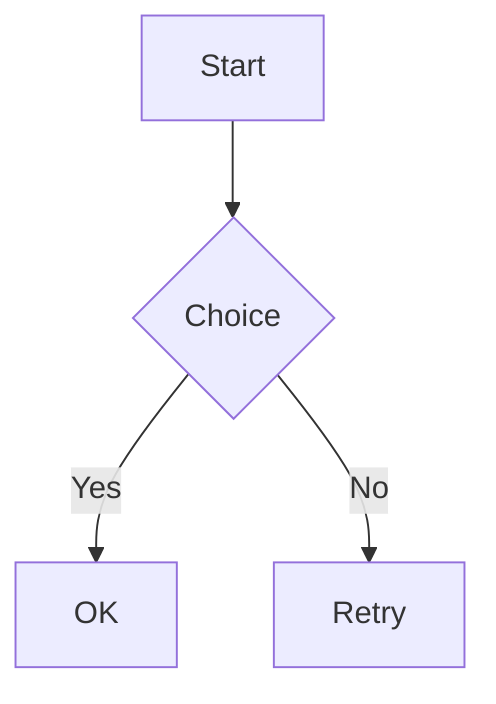
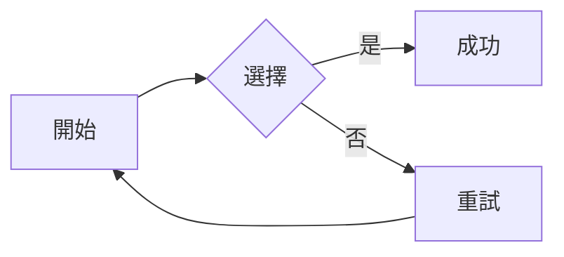
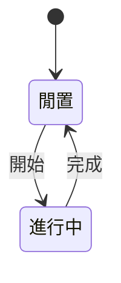

# Mermaid fixture（`mdview`）

這個檔案專門用來測 Mermaid code block 的行為（不依賴網路也能做 deterministic 測試）。

SCROLLTARGET_MERMAID

```mermaid
flowchart TD
  A[Start] --> B{Choice}
  B -->|Yes| C[OK]
  B -->|No| D[Retry]
```

```mermaid
flowchart LR
  A[開始] --> B{選擇}
  B -->|是| C[成功]
  B -->|否| D[重試]
  D --> A
```

```mermaid
stateDiagram-v2
  [*] --> 閒置
  閒置 --> 進行中: 開始
  進行中 --> 閒置: 完成
```

下方應該會出現多個 diagram attachment（先 placeholder，之後若有網路會載入圖）。

