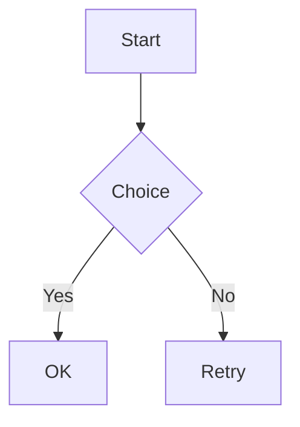
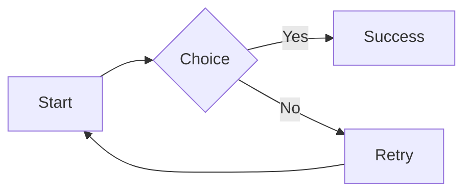
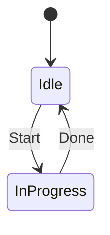

# Mermaid fixture (`mdview`)

This file is dedicated to testing Mermaid code block behavior (deterministic and does not require network access).

SCROLLTARGET_MERMAID

Multiple diagram attachments should appear below (placeholder first; if network is available they may load the images).

