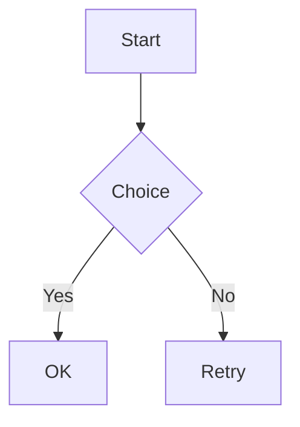

# mdview fixture (`mdview`)

This file is a Markdown sample used by automated tests and manual smoke runs. Please keep the key content stable—tests depend on it.

## Heading levels (H2 test)

### H3 heading (inline code: `mdview`)

#### H4 heading

Bold **bold**, italic *italic*, strikethrough ~~strike~~, and a link to [GitHub](https://github.com).

## Lists (indent should resemble macOS Notes)

### Basic lists

•  lorem ipsum dolor sit amet, consectetur adipiscing elit. Sed do eiusmod tempor incididunt ut labore et dolore magna aliqua.
•  lorem ipsum dolor sit amet, consectetur adipiscing elit. Ut enim ad minim veniam, quis nostrud exercitation ullamco laboris nisi ut aliquip ex ea commodo consequat.

1.  lorem ipsum dolor sit amet, consectetur adipiscing elit. Duis aute irure dolor in reprehenderit in voluptate velit esse cillum dolore eu fugiat nulla pariatur.
2.  lorem ipsum dolor sit amet, consectetur adipiscing elit. Excepteur sint occaecat cupidatat non proident, sunt in culpa qui officia deserunt mollit anim id est laborum.

### Multi-level list indentation test

- Level 1 item
  - Level 2 item A
  - Level 2 item B
    - Level 3 item 1
    - Level 3 item 2
      - Level 4 item α
      - Level 4 item β
  - Level 2 item C
- Level 1 item 2

1. Level 1 ordered item
   1. Level 2 ordered item
   2. Level 2 ordered item
      - Mixed: unordered sub-item
      - Mixed: unordered sub-item
   3. Level 2 ordered item
2. Level 1 ordered item 2

- [ ] Task: level 1
  - [ ] Task: level 2 (unchecked)
  - [x] Task: level 2 (checked)
    - [ ] Task: level 3
- [x] Task: level 1 (checked)

## Images (example)

> Note: this uses a non-existent local file as an example; the renderer will fall back to text (no network/external files required).


## Mermaid

> Mermaid **keeps the code block** and also inserts a diagram below (via `mermaid.ink`, **prefers PNG for fidelity**; requires network; loads non-blockingly; click to open the original SVG link).



## Code example

```swift
import AppKit

final class AppDelegate: NSObject, NSApplicationDelegate {
    func applicationDidFinishLaunching(_ notification: Notification) {
        print("Hello, Markdown Viewer!")
    }
}
```

## Table example

| Feature | Status | Notes |
|--------|--------|------|
| Basic rendering | ✅ | Native (NSTextView) |
| Syntax highlighting | ✅ | Highlightr / regex fallback |
| File watching | ✅ | Auto reload |
| Dark mode | ✅ | Follow system |

## Blockquote

> This is a blockquote.
> It can span multiple lines.
>
> — Author

## Task list

- [x] Build the basic structure
- [x] Implement native rendering
- [ ] Add more features
