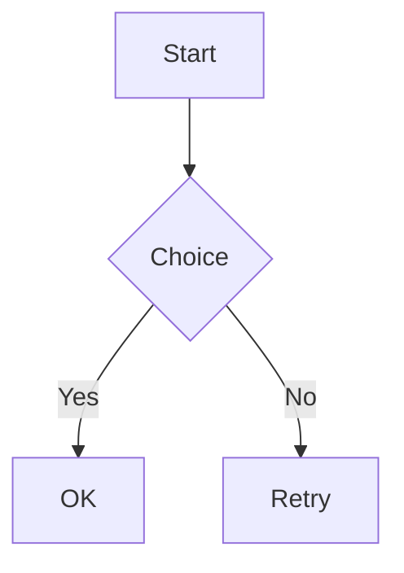

# mdview fixture（`mdview`）

這個檔案是給自動化測試與手動 smoke 用的 Markdown 範例（請保持關鍵字內容穩定，測試會依賴）。

## 標題層級（二級標題測試）

### 第三級標題（inline code：`mdview`）

#### 第四級標題

粗體 **bold**、斜體 *italic*、刪除線 ~~strike~~、連結 [GitHub](https://github.com)。

## 清單（縮排應接近 macOS Notes）

### 基本清單

•  lorem ipsum dolor sit amet, consectetur adipiscing elit. Sed do eiusmod tempor incididunt ut labore et dolore magna aliqua.
•  lorem ipsum dolor sit amet, consectetur adipiscing elit. Ut enim ad minim veniam, quis nostrud exercitation ullamco laboris nisi ut aliquip ex ea commodo consequat.

1.  lorem ipsum dolor sit amet, consectetur adipiscing elit. Duis aute irure dolor in reprehenderit in voluptate velit esse cillum dolore eu fugiat nulla pariatur.
2.  lorem ipsum dolor sit amet, consectetur adipiscing elit. Excepteur sint occaecat cupidatat non proident, sunt in culpa qui officia deserunt mollit anim id est laborum.

### 多級清單縮排測試

- 第一級項目
  - 第二級項目 A
  - 第二級項目 B
    - 第三級項目 1
    - 第三級項目 2
      - 第四級項目 α
      - 第四級項目 β
  - 第二級項目 C
- 第一級項目 2

1. 第一級有序項目
   1. 第二級有序項目
   2. 第二級有序項目
      - 混合：無序子項
      - 混合：無序子項
   3. 第二級有序項目
2. 第一級有序項目 2

- [ ] 待辦事項：第一級
  - [ ] 待辦事項：第二級未完成
  - [x] 待辦事項：第二級已完成
    - [ ] 待辦事項：第三級
- [x] 待辦事項：第一級已完成

## 圖片（範例）

> 注意：這裡用不存在的檔案做範例，渲染器會 fallback 顯示文字（不依賴網路/外部檔案）。


## Mermaid

> Mermaid 會**保留 code block**，並在下方額外顯示 diagram（透過 `mermaid.ink` **優先顯示 PNG（與原版渲染一致）**；需要網路；非阻塞載入；點擊圖可開啟原始 SVG 連結）。



## 程式碼範例

```swift
import AppKit

final class AppDelegate: NSObject, NSApplicationDelegate {
    func applicationDidFinishLaunching(_ notification: Notification) {
        print("Hello, Markdown Viewer!")
    }
}
```

## 表格範例

| 功能 | 狀態 | 備註 |
|------|------|------|
| 基本渲染 | ✅ | Native (NSTextView) |
| 語法高亮 | ✅ | Highlightr / regex fallback |
| 檔案監控 | ✅ | 自動重載 |
| 深色模式 | ✅ | 跟隨系統 |

## 引用區塊

> 這是一個引用區塊。
> 可以包含多行內容。
>
> — 作者

## 待辦清單

- [x] 建立基本架構
- [x] 實作原生渲染
- [ ] 新增更多功能
