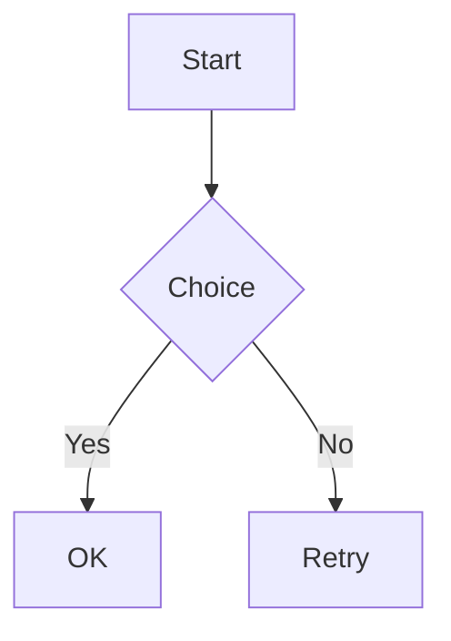

# mdview fixture（`mdviewer`）

這個檔案是給自動化測試與手動 smoke 用的 Markdown 範例（請保持關鍵字內容穩定，測試會依賴）。

## 標題層級

### 第三級標題（inline code：`mdviewer`）

粗體 **bold**、斜體 *italic*、刪除線 ~~strike~~、連結 [GitHub](https://github.com)。

## 清單（縮排應接近 macOS Notes）

- abc
- def
- ijk

1. abc
2. def
3. ijk

## 圖片（範例）

> 注意：這裡用不存在的檔案做範例，渲染器會 fallback 顯示文字（不依賴網路/外部檔案）。


## Mermaid（可選）

> 若要把 Mermaid 真的渲染成圖，請用 `--mermaid`（需要系統有 `mmdc`）；否則會以 code block 顯示原始碼。



## 程式碼範例

```swift
import AppKit

final class AppDelegate: NSObject, NSApplicationDelegate {
    func applicationDidFinishLaunching(_ notification: Notification) {
        print("Hello, Markdown Viewer!")
    }
}
```

## 表格範例

| 功能 | 狀態 | 備註 |
|------|------|------|
| 基本渲染 | ✅ | Native (NSTextView) |
| 語法高亮 | ✅ | Highlightr / regex fallback |
| 檔案監控 | ✅ | 自動重載 |
| 深色模式 | ✅ | 跟隨系統 |

## 引用區塊

> 這是一個引用區塊。
> 可以包含多行內容。
>
> — 作者

## 待辦清單

- [x] 建立基本架構
- [x] 實作原生渲染
- [ ] 新增更多功能
